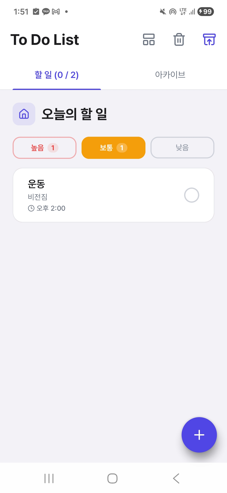
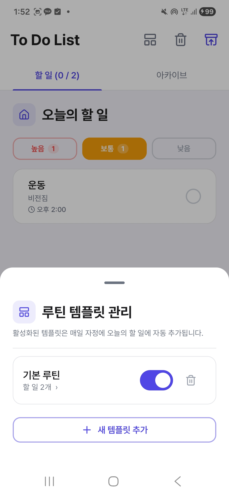
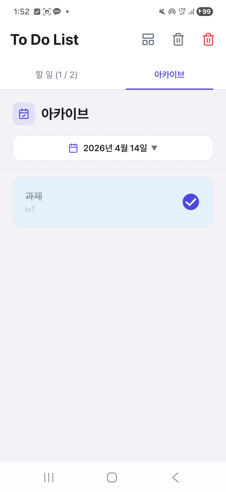
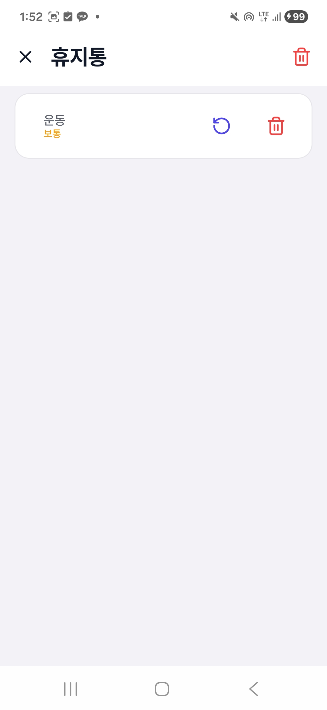

# To Do List


<!-- APP_VERSION: v1.3.1 -->


> 우선순위 기반 할 일 관리 + 루틴 템플릿 + AI 자동 릴리즈 노트까지 갖춘  
> Jetpack Compose + Material 3 기반 안드로이드 앱

---

## 스크린샷

| 메인 화면 | 루틴 템플릿 | 아카이브 | 휴지통 |
|:---------:|:-----------:|:--------:|:------:|
|  |  |  |  |

---

## 주요 기능

### 1. 직관적인 할 일 관리
- **우선순위 3단계** (높음 / 보통 / 낮음) — 스와이프 탭(Pager)으로 분류 탐색
- **BottomSheet 빠른 입력** — FAB 한 번으로 제목·메모·우선순위·마감 시간 설정
- **스와이프 삭제** — 좌측으로 밀어 휴지통 이동, 5초 이내 Undo 지원
- **작성 중 임시 저장** — 시트를 닫아도 draft 유지, 다시 열면 자동 복원
- **잠금화면 알림** — 할 일별 잠금화면 노출 여부 개별 설정

### 2. 루틴 템플릿 시스템
- **그룹 단위 템플릿** — 반복되는 할 일들을 하나의 그룹으로 묶어 재사용
- **자정 자동 주입** — 활성화된 템플릿은 매일 자정 오늘의 할 일 목록에 자동 추가
- **즉시 추가(Manual Injection)** — '오늘 할 일에 즉시 추가하기' 버튼으로 원할 때 언제든 바로 적용
- **중복 방지** — SharedPreferences 기반으로 동일 날짜에 재주입 차단

### 3. 아카이브(기록) 시스템
- **날짜별 완료 기록** — 달력(DatePicker)으로 특정 날짜의 완료 항목 조회
- **UTC 버그 해결** — 타임존 오프셋을 정확히 보정, 날짜 선택이 항상 로컬 시간 기준
- **수동 동기화** — 당일 완료 항목을 아카이브에 즉시 반영
- **일괄 휴지통 이동** — 선택한 날짜의 완료 항목 전체를 한 번에 삭제

### 4. 휴지통
- **Soft Delete** — 삭제 즉시 영구 제거하지 않고 휴지통으로 이동 보관
- **개별 복구** — 휴지통에서 항목을 원래 목록으로 되돌리기
- **영구 삭제 / 비우기** — 개별 또는 전체 완전 삭제

### 5. 세밀한 UX
- **통합 BackHandler** — 다이얼로그·BottomSheet가 열려 있을 때 뒤로 가기를 누르면 앱 종료 대신 해당 창만 닫힘
- **마감 알림** — AlarmManager 기반, 마감 시각 정확 발생 + 사전 알림(10분/30분/1시간 전)
- **상태바 상시 알림** — Foreground Service로 미완료 할 일 개수 실시간 표시
- **부팅 후 알람 자동 복원** — `BOOT_COMPLETED` 수신 시 모든 알람 재등록

### 6. 자동화 CI/CD
- **Release APK 자동 빌드·서명** — `v*` 태그 push 시 GitHub Actions가 키스토어로 서명 후 GitHub Release에 자동 게시
- **AI 릴리즈 노트 자동 작성** — Gemini API가 커밋 메시지를 분석해 이 README의 변경 이력 섹션을 자동으로 업데이트

---

## 기술 스택

| 분류 | 기술 |
|:---|:---|
| **언어** | Kotlin |
| **UI** | Jetpack Compose, Material 3, Pretendard 폰트 |
| **아키텍처** | MVVM, Clean Architecture 패턴 지향, Single Activity |
| **상태 관리** | StateFlow, Channel (일회성 이벤트) |
| **로컬 DB** | Room Database (Flow 기반 반응형 쿼리, Migration v1→v5) |
| **DI** | Dagger Hilt + KSP |
| **비동기** | Kotlin Coroutines |
| **알림** | AlarmManager, NotificationCompat, Foreground Service |
| **CI/CD** | GitHub Actions (Debug 빌드 · Release 서명 · AI README 자동화) |
| **AI** | Google Gemini API (릴리즈 노트 자동 생성) |
| **최소 SDK** | API 26 (Android 8.0) |
| **타겟 SDK** | API 35 (Android 15) |

---

## 아키텍처

```
presentation/
├── screen/
│   ├── MainScreen.kt               # 루트 화면 — 탭 + TopAppBar + BackHandler
│   ├── TaskItem.kt                 # 할 일 카드 (우선순위 컬러 액센트)
│   ├── AddTaskBottomSheet.kt       # 할 일 추가/수정 시트
│   ├── TemplateManageBottomSheet.kt# 루틴 템플릿 관리 시트 (그룹 목록 ↔ 그룹 상세)
│   └── TrashScreen.kt              # 휴지통 화면
├── viewmodel/
│   └── TaskViewModel.kt            # UI 상태·draft 관리, 템플릿 자동/수동 주입
└── theme/
    ├── Color.kt                    # Deep Indigo 팔레트
    ├── Type.kt                     # Pretendard 타이포그래피
    └── Theme.kt                    # Material 3 ColorScheme

data/
├── local/
│   ├── entity/
│   │   ├── TaskEntity.kt           # 할 일 (Priority, RepeatType, dueDate …)
│   │   ├── RoutineTemplateGroupEntity.kt   # 템플릿 그룹
│   │   ├── RoutineTemplateTaskEntity.kt    # 템플릿 할 일 (그룹 FK CASCADE)
│   │   └── RoutineTemplateGroupWithTasks.kt# @Relation POJO (1:N)
│   ├── dao/
│   │   ├── TaskDao.kt
│   │   └── RoutineTemplateDao.kt
│   └── AppDatabase.kt              # Room DB (version 5, Migration 1→5)
└── repository/
    ├── TaskRepository(Impl).kt
    └── RoutineTemplateRepository(Impl).kt

service/
├── TodoForegroundService.kt        # 상태바 상시 알림
├── AlarmScheduler.kt               # AlarmManager 래퍼
└── NotificationHelper.kt

receiver/
├── TodoAlarmReceiver.kt
├── TaskActionReceiver.kt
└── BootReceiver.kt
```

### 데이터 흐름

```
Room DB (Flow)
  └─ Repository
      └─ ViewModel (StateFlow)
          └─ Compose UI (collectAsStateWithLifecycle)
              └─ 사용자 액션 → ViewModel → Repository → Room
                                  ├─ AlarmScheduler
                                  └─ TodoForegroundService
```

---

## 빌드 및 실행

**요구 사항**
- Android Studio Hedgehog 이상
- JDK 17
- Android 8.0 (API 26) 이상 기기 또는 에뮬레이터

```bash
git clone https://github.com/kanghyeonLee/ToDoList.git
cd ToDoList
./gradlew assembleDebug
```

서명된 릴리즈 APK는 [Releases](https://github.com/kanghyeonLee/ToDoList/releases) 페이지에서 다운로드할 수 있습니다.

---

## CI/CD 파이프라인

```
main push / PR  →  Job 1: Debug APK 빌드 및 아티팩트 업로드
v* 태그 push   →  Job 2: Release APK 서명 → GitHub Release 게시
                →  Job 3: Gemini API로 커밋 분석 → README 릴리즈 노트 자동 업데이트
```

| 필요한 GitHub Secret | 설명 |
|:---|:---|
| `KEYSTORE_BASE64` | base64 인코딩된 .jks 키스토어 |
| `KEY_ALIAS` | 키 alias |
| `KEY_PASSWORD` | 키 비밀번호 |
| `STORE_PASSWORD` | 키스토어 비밀번호 |
| `LLM_API_KEY` | Gemini 또는 OpenAI API 키 |

> GitHub Variables에서 `LLM_PROVIDER`를 `gemini` 또는 `openai`로 설정 (기본값: `gemini`)

---

## 변경 이력 (Changelog)

> 이 섹션은 `v*` 태그를 push할 때 AI(Gemini)가 커밋 메시지를 분석해 자동으로 업데이트합니다.

<!-- CHANGELOG_START -->
<!-- CHANGELOG_END -->
